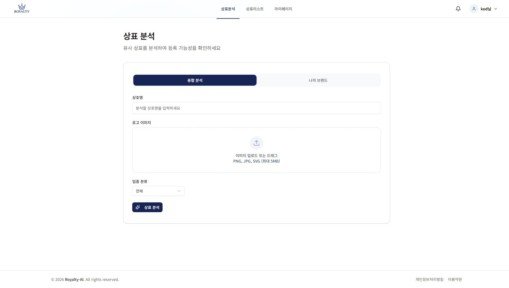
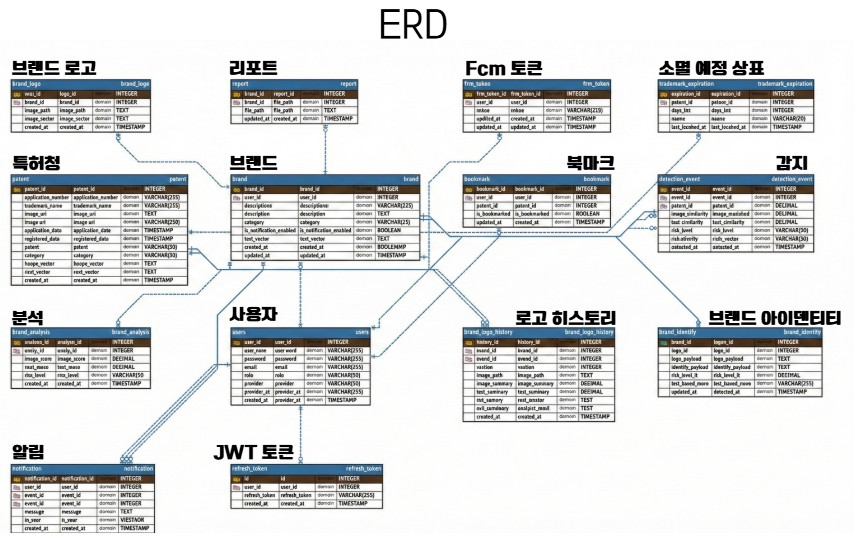

# 🦁 Royalty - AI 기반 상표 분석 플랫폼


> AI 기반 이미지·텍스트 벡터 분석을 통한 **상표 유사도 검색 및 브랜드 아이덴티티 분석** 플랫폼

---

## 🌐 배포 주소

**Live Demo**: [http://43.202.167.232/](http://43.202.167.232/)

---

## 📋 목차

- [배포 주소](#-배포-주소)
- [프로젝트 소개](#-프로젝트-소개)
- [주요 기능](#-주요-기능)
- [스크린샷](#-스크린샷)
- [기술 스택](#-기술-스택)
- [시스템 아키텍처](#-시스템-아키텍처)
- [시작하기](#-시작하기)
- [프로젝트 구조](#-프로젝트-구조)
- [API 문서](#-api-문서)
- [팀원](#-팀원)

---

## 🎯 프로젝트 소개

**Royalty**는 AI 기술을 활용하여 상표의 유사도를 분석하고, 브랜드 아이덴티티를 생성하는 플랫폼입니다.
MobileNet과 Ko-SBERT 모델을 사용한 벡터 기반 검색으로 기존 상표 데이터베이스와의 유사도를 분석하며,
OpenAI API를 통해 상세한 브랜드 분석 리포트를 제공합니다.

### 핵심 가치

- 🔍 **정확한 유사도 분석**: 이미지와 텍스트를 벡터화하여 정밀한 상표 유사도 검색
- 🤖 **AI 기반 인사이트**: OpenAI를 활용한 상표 분석 및 브랜드 아이덴티티 생성
- 🔔 **실시간 알림**: 유사 상표 출원 시 실시간 알림 제공
- 📊 **데이터 시각화**: 상표 변천사 및 분석 결과를 직관적으로 시각화

---

## ✨ 주요 기능

### 1. 🔎 상표 분석 (Hybrid Search)

- **이미지 벡터화**: MobileNet을 사용한 로고 이미지 특징 추출
- **텍스트 벡터화**: Ko-SBERT를 사용한 상표명 임베딩
- **하이브리드 검색**: 이미지와 텍스트를 결합한 정밀 유사도 분석
- **AI 상세 분석**: OpenAI 기반 대응 전략 및 위험도 분석

### 2. 📜 상표 리스트

- 등록된 상표 검색 및 필터링
- 카테고리별 상표 분류
- 상세 정보 조회

### 3. 👤 마이페이지

- **나의 브랜드 관리**: 등록한 브랜드 관리 및 모니터링
- **북마크**: 관심 상표 저장 및 관리
- **상표 변천사**: Recharts를 활용한 브랜드 분석 이력 시각화
- **AI 분석 저장**: 과거 분석 결과 조회

### 4. 🎨 종합 분석

- 상호명과 로고를 기반으로 한 브랜드 아이덴티티 생성
- 종합 분석 리포트
- PDF 형식 다운로드 지원

### 5. 🔔 실시간 알림

- Firebase Cloud Messaging을 통한 푸시 알림
- 유사 상표 출원 시 자동 알림
- 알림 설정 관리

### 6. 🔐 인증 및 회원 관리

- 이메일 인증 (Google)
- 카카오 소셜 로그인
- JWT 기반 토큰 인증
- 회원가입 및 탈퇴

---

## 📸 스크린샷

### 메인 페이지


### 상표 분석

<table>
  <tr>
    <td width="50%">
      
      <p align="center"><em>상표명 및 로고 입력</em></p>
    </td>
    <td width="50%">
      
      <p align="center"><em>AI 유사도 분석 결과</em></p>
    </td>
  </tr>
</table>

### 상표 리스트


### 브랜드 관리

<table>
  <tr>
    <td width="50%">
      
      <p align="center"><em>상표 분석 이력 시각화</em></p>
    </td>
    <td width="50%">
      
      <p align="center"><em>종합 분석 리포트</em></p>
    </td>
  </tr>
</table>

### BI 분석


---

## 🛠 기술 스택

### Frontend

- **Framework**: React 19.2.0 + TypeScript
- **Build Tool**: Vite 7.2.4
- **Styling**: Tailwind CSS 4.1.18
- **State Management**: TanStack Query (React Query) 5.90.17
- **UI Components**: Radix UI + shadcn/ui
- **Routing**: React Router DOM 7.12.0
- **Charts**: Recharts 3.6.0
- **Animation**: Framer Motion 12.29.0
- **Form**: React Hook Form + Zod
- **HTTP Client**: Axios 1.13.2

### Backend

- **Framework**: Spring Boot (Java/Maven)
- **Authentication**: JWT, OAuth 2.0 (Kakao)
- **Database**: PostgreSQL (AWS RDS)
- **Push Notification**: Firebase Admin SDK

### AI/ML

- **Framework**: FastAPI + Uvicorn
- **Deep Learning**: PyTorch, Torchvision
- **Image Model**: MobileNet (이미지 벡터화)
- **Text Model**: Sentence-Transformers (Ko-SBERT)
- **NLP**: Jamo, python-Levenshtein
- **Scheduler**: APScheduler (주기적 특허 데이터 수집)
- **Database**: PostgreSQL with pgvector extension
- **External API**: OpenAI API (상세 분석)

### Infrastructure

- **Containerization**: Docker, Docker Compose
- **Cloud**: AWS (RDS, S3)
- **Database**: PostgreSQL with pgvector (벡터 검색)
- **Storage**: AWS S3 (이미지 저장)

---

## 🏗 시스템 아키텍처


### 데이터베이스 ERD



### 데이터 플로우

1. **상표 검색**:
   - Frontend → AI Server (이미지/텍스트 벡터화)
   - AI Server → PostgreSQL (벡터 유사도 검색)
   - PostgreSQL → AI Server → Frontend (결과 반환)

2. **AI 분석**:
   - Frontend → Backend (분석 요청)
   - Backend → OpenAI API (상세 분석)
   - Backend → Frontend (분석 결과 + PDF)

3. **알림**:
   - Scheduler (FastAPI) → PostgreSQL (새로운 상표 감지)
   - FastAPI → Backend → Firebase → 사용자

---

## 🚀 시작하기

### 필수 요구사항

- Node.js 18 이상
- Java 17 이상
- Python 3.9 이상
- Docker & Docker Compose
- Maven

### 환경 변수 설정

#### Frontend (.env)

```env
VITE_KAKAO_REDIRECT_URI=http://localhost:5173/oauth/kakao/callback
VITE_FIREBASE_AUTH_DOMAIN=royalty-push.firebaseapp.com
VITE_FIREBASE_PROJECT_ID=royalty-push
VITE_FIREBASE_STORAGE_BUCKET=royalty-push.firebasestorage.app
VITE_FIREBASE_MESSAGING_SENDER_ID=1064350770555
VITE_FIREBASE_APP_ID=1:1064350770555:web:dbecfbfe5e6e7e6e47c9de
```

#### Backend (application.properties)

```properties
# 팀장에게 전달받은 파일 사용
# AWS RDS 접속 정보 포함
# 경로: backend/src/main/resources/application.properties
```

#### AI Server (.env)

```env
AWS_ACCESS_KEY_ID=your_access_key
AWS_SECRET_ACCESS_KEY=your_secret_key
AWS_BUCKET_NAME=royalty-team-bucket-2026
AWS_REGION=ap-northeast-2
```

### 설치 및 실행

#### 1. 저장소 클론

```bash
git clone https://github.com/your-org/royalty.git
cd royalty
```

#### 2. Frontend 실행

```bash
cd frontend
npm install
npm run dev
```

→ http://localhost:5173 에서 접속 가능

#### 3. Backend 실행

```bash
cd backend
# STS4 또는 IntelliJ에서 BackendApplication 실행
# 또는 Maven 사용:
mvn spring-boot:run
```

→ http://localhost:8080 에서 API 서버 실행

#### 4. AI Server (Docker) 실행

```bash
# 프로젝트 루트에서
docker-compose down  # 기존 컨테이너 정리
docker-compose up -d --build  # 재빌드 및 실행
```

→ http://localhost:8000 에서 FastAPI 서버 실행

컨테이너 정상 실행 확인:

```bash
docker ps
# royalty-ai 컨테이너가 실행 중이어야 함
```

---

## 📁 프로젝트 구조

### Frontend

```
frontend/
├── src/
│   ├── features/           # 기능별 모듈
│   │   ├── analysis/       # 상표 분석
│   │   ├── auth/           # 인증
│   │   ├── bookmark/       # 북마크
│   │   ├── brands/         # 브랜드 관리
│   │   ├── mypage/         # 마이페이지
│   │   ├── notification/   # 알림
│   │   └── trademark/      # 상표 리스트
│   ├── shared/             # 공유 컴포넌트
│   │   ├── components/     # UI 컴포넌트
│   │   ├── auth/           # 인증 로직
│   │   └── api/            # API 설정
│   ├── routes/             # 라우팅 설정
│   └── lib/                # 유틸리티
├── package.json
└── vite.config.ts
```

### Backend

```
backend/
├── src/
│   └── main/
│       ├── java/
│       │   └── com/royalty/
│       │       ├── controller/
│       │       ├── service/
│       │       ├── repository/
│       │       ├── entity/
│       │       └── config/
│       └── resources/
│           └── application.properties
└── pom.xml
```

### AI Server

```
ai-server/
├── main.py                 # FastAPI 메인 애플리케이션
├── analyzer.py             # 벡터 분석 엔진
├── db_search.py            # DB 검색 엔진
├── scheduler.py            # 주기적 데이터 수집
├── requirements.txt
└── Dockerfile
```

---

## 📡 API 문서

### Backend API Endpoints

#### 🔐 인증 (AUTH)

```http
POST   /api/auth/signup          # 회원가입
POST   /api/auth/login           # 로그인 (JWT 발급)
POST   /api/auth/logout          # 로그아웃 (Refresh Token 무효화)
POST   /api/auth/refresh         # 토큰 재발급 (Access Token 갱신)
GET    /auth/me                  # 현재 로그인 사용자 정보 조회
PUT    /api/userh/password       # 비밀번호 변경
DELETE /api/userh/me             # 회원 탈퇴
```

#### 🔍 분석 (ANALYSIS)

```http
POST   /analysis/run             # 분석 실행 (로고 + 상호명 유사도 검사)
POST   /api/analysis/analyze     # AI 상세 분석
POST   /api/analysis/save-basic  # 내 브랜드 저장
GET    /analysis/report/{brandId} # PDF 리포트 다운로드
```

#### 🎨 브랜드 아이덴티티 (IDENTITY)

```http
GET    /api/identity/{brandId}           # 현재 BI 조회
POST   /api/identity/{brandId}/analyze   # BI 분석 버튼 (입력 변경 시 BI 생성/갱신)
```

#### 📜 상표 탐색 (TRADEMARK)

```http
GET    /trademark/list           # 상표 리스트 조회 (필터/정렬/카테고리)
GET    /trademark/{id}           # 상표 상세 조회
```

#### ⭐ 북마크 (BOOKMARK)

```http
POST   /trademark/{id}/bookmark  # 상표 북마크 추가
DELETE /trademark/{id}/bookmark  # 상표 북마크 제거
GET    /mypage/bookmark          # 내가 북마크한 상표 목록
```

#### 🏢 내 브랜드 (MY BRAND)

```http
GET    /mypage                              # 마이페이지
GET    /mypage/brand                        # 등록된 내 브랜드 목록 조회
POST   /mypage/brand/{brandId}              # 브랜드 정보 수정
DELETE /mypage/brand/{brandId}              # 브랜드 삭제
GET    /mypage/brand/{brandId}              # 브랜드 상세 조회
PATCH  /mypage/brand/{brandId}/notification # 알림 설정
```

#### 🔔 알림 (NOTIFICATION)

```http
GET    /users/notification        # 내 알림 목록 조회
POST   /users/notification/read   # 개별 알림 읽음 처리
POST   /users/notification/token  # FCM 토큰 등록/갱신
```

#### 📄 리포트 (REPORT)

```http
GET    /mypage/brand/{brandId}/report # 리포트 PDF 다운로드
```

#### 📁 파일 업로드 (FILE)

```http
POST   /file/upload/logo          # 로고 이미지 업로드
DELETE /file/delete/logo          # 업로드 취소 시 삭제
```

---

### AI Server Endpoints

#### 1. 하이브리드 검색

```http
POST /api/v1/search/hybrid
Content-Type: multipart/form-data

Parameters:
- query_text: string (optional) - 상표명
- file: file (optional) - 로고 이미지

Response:
{
  "status": "success",
  "results": [
    {
      "patent_id": 1,
      "trademark_name": "상표명",
      "applicant": "출원인",
      "similarity_score": 0.95,
      "image_url": "https://...",
      ...
    }
  ]
}
```

#### 2. 벡터화 API (Backend 전용)

```http
POST /api/v1/vectorize
Content-Type: multipart/form-data

Parameters:
- text: string (optional)
- file: file (optional)

Response:
{
  "status": "success",
  "text_vector": [...],
  "image_vector": [...]
}
```

#### 3. 테스트 데이터 삽입 (개발용)

```http
POST /api/v1/test/insert/image
Content-Type: multipart/form-data

Parameters:
- trademark_name: string
- applicant: string
- application_number: string
- category: string
- application_date: string (YYYY-MM-DD)
- file: file
```

---

## ❓ FAQ

### Q1. 로그인이 안 되고 '존재하지 않는 사용자'라고 표시됩니다.

**A.** DB가 AWS RDS로 이전되면서 기존 로컬 데이터가 초기화되었습니다. 새로 회원가입을 진행해주세요.

### Q2. AI 검색이 작동하지 않습니다.

**A.** Docker 컨테이너가 최신 설정으로 실행되고 있는지 확인하세요:

```bash
docker-compose down
docker-compose up -d --build
```

### Q3. 벡터 검색이 느립니다.

**A.** PostgreSQL의 pgvector 인덱스가 제대로 생성되어 있는지 확인하세요. 데이터가 많을 경우 IVFFlat 인덱스 생성을 권장합니다.

### Q4. S3 이미지 업로드가 실패합니다.

**A.** AWS 자격 증명이 올바르게 설정되었는지 확인하세요. `.env` 파일의 `AWS_ACCESS_KEY_ID`와 `AWS_SECRET_ACCESS_KEY`를 점검하세요.

---

## 🤝 기여하기

1. Fork the Project
2. Create your Feature Branch (`git checkout -b feature/AmazingFeature`)
3. Commit your Changes (`git commit -m 'Add some AmazingFeature'`)
4. Push to the Branch (`git push origin feature/AmazingFeature`)
5. Open a Pull Request

### 코드 스타일

- **Frontend**: Prettier + ESLint 설정 준수
- **Backend**: Google Java Style Guide
- **Python**: PEP 8

---

## 📝 라이선스

This project is licensed under the MIT License - see the LICENSE file for details

---

## 👥 팀원

### Frontend

- 박덕인
- 하용군
- 조민서

### Backend

- 김우영
- 김동현
- 권혁주
- 하용군

### AI/ML

- 김우영

---

## 📞 문의

프로젝트 관련 문의사항은 이슈를 생성해주세요.

---

**Made with ❤️ by Royalty Team**
